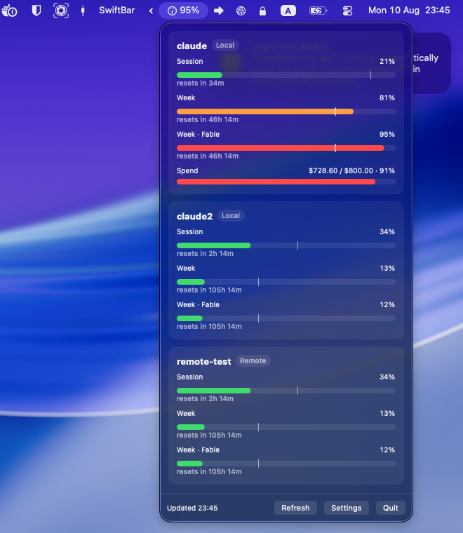
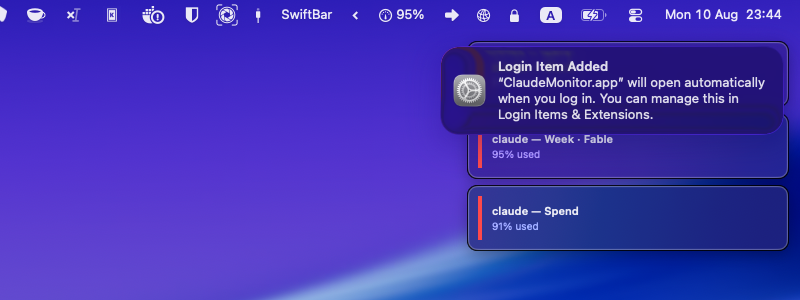
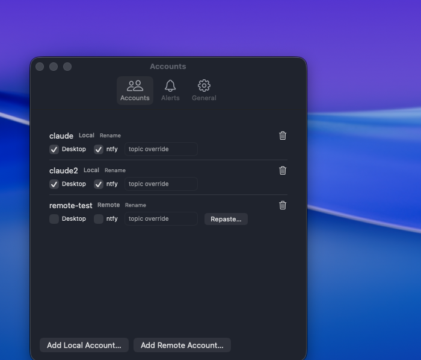

# User Guide

## Contents

- [Menu bar](#menu-bar)
- [Popover](#popover)
- [Accounts](#accounts)
  - [Local accounts](#local-accounts)
  - [Codex accounts](#codex-accounts)
  - [Remote accounts](#remote-accounts)
- [Alerts](#alerts)
  - [How a level is decided](#how-a-level-is-decided)
  - [De-dupe and re-arm](#de-dupe-and-re-arm)
  - [Auth alerts](#auth-alerts)
  - [Alert sinks](#alert-sinks)
- [Settings](#settings)
- [ntfy setup from zero](#ntfy-setup-from-zero)
- [Troubleshooting](#troubleshooting)
- [Logs](#logs)
- [Is it safe?](#is-it-safe)

## Menu bar

Agents Monitor lives only in the menu bar — there's no Dock icon and no main window. The label
is a gauge icon plus the **worst percent across every configured account** (e.g. `95%`), updated
after every poll. If you turn off "Show percent in menu bar" in Settings, only the icon remains.

The label is rendered as a template image by SwiftUI, so it can't carry severity color — it's
always plain text/icon. Color lives in the popover and in toasts instead.

## Popover

Click the menu bar icon to open the popover: one card per account, each with a row per limit
plus a spend row when applicable.



**Per limit row:**
- **Label** — `Session` (the rolling 5-hour window), `Week` (7-day window), or
  `Week · <model>` for a model-scoped weekly limit (e.g. `Week · Fable`). Any limit kind
  Anthropic adds in the future renders the same way automatically — no update required.
- **Progress bar**, colored by severity exactly as the API reports it:
  - green = normal
  - orange = warning
  - red = critical
- **Pacing tick** — the thin vertical mark on the bar. It marks where you'd be right now if
  you were burning the limit at a perfectly even rate across the whole window (elapsed time ÷
  window length). Your percent bar sitting to the *left* of the tick means you're pacing under
  budget for the window; sitting to the *right* means you're burning faster than even and will
  likely hit the limit before it resets.
- **Percent** and a **"resets in Xh Ym"** countdown, computed from the API's `resets_at`.

**Spend row** (only shown when there's an extra-usage budget configured or something's already
been spent): `$728.60 / $800.00 · 91%` — extra usage billed this month, in dollars. There's no
progress bar or percent shown if the account has no configured spend limit, just the amount
used.

**Error states**, shown in place of the limit rows when something's wrong with that account:
see the [Troubleshooting table](#troubleshooting) for what each one means and how to fix it.

**Footer:** last-refresh time, **Refresh** (manual poll, ignores the interval), **Settings**,
**Quit**.

## Accounts

### Local accounts

A local account is any `CLAUDE_CONFIG_DIR` that's already logged in to Claude Code on this Mac
— `~/.claude` by default, or `~/.claude-<name>` for an additional profile.

- **Discovery is automatic on first launch:** Agents Monitor checks `~/.claude` and globs
  `~/.claude-*`, adding every directory that has a matching keychain entry. You can add more
  later from Settings → Accounts → **Add Claude Account…** (folder picker).
- **Naming:** taken from `oauthAccount.emailAddress` (or `organizationName`) in that profile's
  `~/.claude*/.claude.json`. If no label is found, it falls back to the directory name. Rename
  any account from Settings or from the popover.
- **Tokens are read fresh from the keychain on every poll and never refreshed by this app.**
  Claude Code owns the refresh token for a local account; if Agents Monitor refreshed it, Claude
  Code's own next refresh would fail with `invalid_grant` and force that profile to `/login`.
  As long as you run Claude Code against that profile occasionally, its token stays fresh on its
  own and Agents Monitor just reads it.
- If a local account's token *does* go stale (you haven't used that profile in a while), the
  card shows **"Login token expired"** — open a Claude Code session for that profile (running
  any command re-triggers its own refresh) rather than `/login`ing unless that doesn't fix it.

### Codex accounts

A Codex account is any `CODEX_HOME` signed in to Codex with a ChatGPT account — `~/.codex` by
default, or `~/.codex-<name>` for an additional profile.

- **Discovery is automatic:** every `~/.codex*` directory holding an `auth.json` with a readable
  ChatGPT token becomes an account. Add a non-standard location later from Settings → Accounts →
  **Add Codex Account…** (folder picker). A login that only has an API key in it (`auth_mode:
  apikey`) is skipped — there's no plan usage behind it to report.
- **Naming:** the signed-in address, read from the claims of the stored `id_token`. Falls back to
  the directory name, and renameable like any other account.
- **Credentials come from a file, not the keychain.** `<CODEX_HOME>/auth.json` is read fresh on
  every poll, and **the token is never refreshed by this app** — same rule as a local Claude
  account, same reason: OpenAI rotates the refresh token on use, so spending it would force
  `codex login`. Running `codex` in that profile occasionally keeps it fresh on its own.
- **What's shown:** the rolling 5-hour window as **Session** and the weekly one as **Week**,
  plus the code-review cap if your plan reports one. There's no spend row: the Codex payload
  reports a remaining credit balance rather than an amount spent, so there is nothing honest to
  put there. OpenAI also sends no severity per window, so the green/orange/red grading is
  applied locally at the same cutoffs Anthropic returns — the two providers' rows mean the same
  thing side by side.

### Remote accounts

Remote accounts are Claude-only. A remote account is one that isn't logged in to Claude Code on
this Mac at all — typically
another machine, or a CI box. Agents Monitor owns its credentials entirely: it stores them in
its own keychain item and refreshes the token itself when it expires.

**To add one:** Settings → Accounts → **Add Remote Account…**, then paste the credentials JSON
from the source machine:

```bash
# macOS (source machine)
security find-generic-password -s "Claude Code-credentials" -w

# Linux (source machine)
cat ~/.claude/.credentials.json
```

Paste the whole JSON blob into the sheet and click **Save**. Agents Monitor validates it parses
and contains `claudeAiOauth.accessToken` before storing it.

**Storage:** a keychain item named `AgentsMonitor-account-<uuid>`, accessible only on this
device (`kSecAttrAccessibleWhenUnlockedThisDeviceOnly` — no iCloud sync). The pasted text is
never written to `UserDefaults` and never logged.

**Rotation-race caveat:** if the source machine's own Claude Code *also* refreshes that same
OAuth lineage — because you're still actively using Claude Code there too — one side's refresh
token wins and the other's becomes stale. When that happens on Agents Monitor's side, the card
shows **"Credentials expired"** with a **Paste credentials…** button; just repeat the paste with
a fresh copy from the source machine. Remote accounts work best for machines you're *not*
actively running Claude Code on concurrently — a spare laptop, a CI account, a profile you only
touch occasionally.

## Alerts

### How a level is decided

For every limit (including spend, when it has a configured budget), Agents Monitor computes:

```
level = max(severity level of the API's own "severity" field, threshold level of the percent)
```

Thresholds default to **80% = warning, 95% = critical** (Settings → Alerts). Whichever is
worse wins — if Anthropic's API reports `critical` at 40% for some reason, that overrides a
looser local threshold.

### De-dupe and re-arm

Each `(account, limit)` pair remembers the last level it alerted at, keyed to the specific reset
window. Rules:

- **Fires only when the level rises** compared to what's stored (`none → warning → critical`).
  Reaching the same level again on a later poll, within the same window, does not re-fire.
- **A window roll re-arms it** — once `resets_at` for that limit changes to a new window and the
  new level is above `none`, it can fire again even at the same level as before the roll.
- The server recomputes `resets_at` on every request and it jitters by a second or two between
  polls even for the *same* window — a **120-second tolerance** treats anything within that
  range as the same window, not a roll. (Without this, an earlier build alerted on every single
  poll: 351 phone pushes in 12 hours.)
- **Dropping below threshold clears the stored level**, so climbing back up alerts again.
- This memory **persists across app relaunches** — an account already sitting above your
  critical threshold when you quit and relaunch does not re-fire just because the app restarted.

### Auth alerts

`needsReauth` (local account, repeated 401) and `needsCredentialsRepaste` (remote account,
refresh grant failed) each alert once at critical under a dedicated `auth` key, and go quiet
again once that account returns to a healthy poll.

A single 401 on a local account usually isn't a real auth failure — it's Claude Code itself
rotating that profile's token mid-poll. Agents Monitor re-reads the keychain and retries once
after a couple of seconds before treating it as anything alertable, and even then the alert
only fires on the **second consecutive** failed poll, not the first. This is why you may
occasionally see a state flash and clear in the logs without any alert at all — that's the
debounce working as intended.

### Alert sinks

Each toggled per account in Settings → Accounts:

- **Desktop** — a standard `UNUserNotificationCenter` banner with sound. Requires the
  notification permission granted on first launch; if denied, these are silently dropped (check
  Settings → Alerts for the current authorization status).
- **ntfy** — a JSON `POST` to your configured server (default `https://ntfy.sh`) and topic.
  Priority 3 for warning, 4 for critical. Each account can override the default topic from
  Settings → Accounts. See [ntfy setup from zero](#ntfy-setup-from-zero) below if you've never
  used it.
- **Toast** — an in-app floating panel, top-right, slide-and-fade with sound, shown regardless
  of which app is frontmost. Global on/off in Settings → General, not per-account.



## Settings

Three tabs, all changes persisted immediately.

**Accounts** — the full account list: rename, per-account **Desktop** and **ntfy** toggles, a
per-account ntfy topic override, remove, plus **Add Claude Account…** / **Add Codex Account…**
(folder pickers validated
against a real keychain entry) and **Add Remote Account…** (paste sheet). A remote account
showing "Credentials expired" gets a **Repaste…** button right on its row.

**Alerts:**
- **Warning / Critical thresholds** — steppers, 1–100%, warning is always kept below critical.
- **ntfy server** and **default topic** — used by any account with ntfy enabled and no
  per-account override.
- **Notification authorization status** — shows whether macOS notifications are currently
  allowed, with a hint to fix it in System Settings if denied.
- **Send Test Alert** — pushes a synthetic warning-level alert through all three sinks so you
  can confirm they're wired up without waiting for a real threshold breach.

**General:**
- **Poll interval** — 30s / 1m / 3m / 5m / 10m. Changing it restarts the poll loop immediately
  with the new interval.
- **Start at login** — registers/unregisters a `SMAppService` login item. Self-healing: it
  re-registers automatically if the app bundle moves, and prompts you to approve it in System
  Settings if macOS requires that.
- **Show percent in menu bar**, **Toast notifications**, **Sound** — straightforward on/off
  toggles.



## ntfy setup from zero

[ntfy](https://ntfy.sh) is a free, open-source push notification service — no account required
for the public server.

1. **Install the app** on your phone: [ntfy for iOS](https://apps.apple.com/app/ntfy/id1625396347)
   or [ntfy for Android](https://play.google.com/store/apps/details?id=io.heckel.ntfy).
2. **Pick a topic name.** A topic is just a string — anyone who knows it can publish or
   subscribe, so pick something unguessable, e.g. `agents-monitor-yourname-a1b2c3`. There's no
   registration step.
3. **Subscribe** to that topic in the ntfy app (`+` → enter the topic name → Subscribe). If
   you're using a self-hosted ntfy server instead of `ntfy.sh`, set the server URL when
   subscribing too.
4. In Agents Monitor, **Settings → Alerts**, set:
   - **Server** — `https://ntfy.sh` (default), or your self-hosted URL.
   - **Default topic** — the topic name from step 2.
5. Enable **ntfy** on whichever accounts should push to your phone (Settings → Accounts). Every
   account with ntfy on and no topic override uses the default topic; give an account its own
   topic override if you want to route it to a different subscriber/device.
6. Click **Send Test Alert** (Settings → Alerts) and confirm it lands on your phone.

## Troubleshooting

| Card shows… | Meaning | Fix |
|---|---|---|
| **Waiting for first refresh…** | App just launched or account just added; no poll has completed yet. | Wait for the poll interval, or click **Refresh**. |
| **Not logged in** | No matching keychain entry for this account's config dir. | Log in to Claude Code for that profile (`claude` then `/login`), or remove the account if it's stale. |
| **Keychain access denied** | A keychain read for this account hit a real consent failure, not the usual silent CLI fallback. Negative-cached for 30 minutes so it won't hammer the prompt. | Usually resolves on its own after the cache expires; if it persists, check Keychain Access for a "Claude Code-credentials…" item with a broken ACL. |
| **Login token expired — open a Claude Code session for this profile** | Local Claude account, two consecutive 401s (not the usual single rotation blip). | Open a terminal, run `claude` for that `CLAUDE_CONFIG_DIR`, let it refresh normally. Only run `/login` if that alone doesn't clear it. |
| **Login token expired — run codex in this profile** | Codex account, two consecutive 401s. | Run `codex` with that `CODEX_HOME`, which rewrites `auth.json` with a fresh token. Only run `codex login` if that alone doesn't clear it. |
| **Credentials expired** (remote account, with a **Paste credentials…** button) | The refresh grant failed — most often the source machine rotated the same lineage first (the rotation race, see [Remote accounts](#remote-accounts)). | Click **Paste credentials…**, re-copy the JSON from the source machine, save. |
| **Rate limited until HH:MM** | The usage endpoint returned 429 for this account. Backoff walks 3 → 6 → 12 → 15 minutes and holds; any successful poll resets it. | Nothing to do — it recovers on its own. Persisting past ~15 minutes on every account suggests you're hitting a shared-bucket throttle; check you're not also running another heavy poller against the same token. |
| **Last refresh failed: …** (below otherwise-normal rows) | The last poll failed but a previous good snapshot is still shown (stale-but-displayed). | Check the error text; if it's a transport error, confirm you have network connectivity. |
| Some other error message | An unclassified failure (unexpected HTTP status, decode error, etc.). | Check the logs (below) for the exact error and open an issue with the log line if it looks like a bug. |

## Logs

Everything logs to unified logging under subsystem `com.roy.agentsmonitor` (categories: `poll`,
`alerts`, `http`, `credentials`, `notify`). No tokens or credential payloads are ever logged;
account display names do appear in your local log (it never leaves this Mac).

```bash
# live tail
/usr/bin/log stream --predicate 'subsystem == "com.roy.agentsmonitor"' --level debug

# recent history
/usr/bin/log show --last 2h --info --debug --predicate 'subsystem == "com.roy.agentsmonitor"'
```

Alert decisions log as:

```
eval <account>/<limit>: <pct>% level=<new> stored=<old> sameWindow=<bool> fire=<bool>
```

— enough to reconstruct exactly why any alert did or didn't fire on a given poll.

## Is it safe?

Fair question — it reads another app's keychain items and calls an endpoint Anthropic hasn't
published.

- **Open source (MIT).** Every line is in this repo.
- **No network calls beyond Anthropic's usage endpoint and your own ntfy server** (if
  configured). No analytics, no telemetry, no third party ever sees your usage data.
- **Never refreshes a local account's token.** The one thing that could damage something
  *outside* this app — burning Claude Code's own refresh token — is explicitly guarded against
  in `CredentialStore`.
- **Remote credentials are stored in the app's own device-only keychain item, never in
  UserDefaults, never logged.**
- **Ad-hoc signed, not notarized** — the one rough edge. See
  [Gatekeeper](INSTALL.md#gatekeeper-ad-hoc-signing) for what that means and how to get past it.
